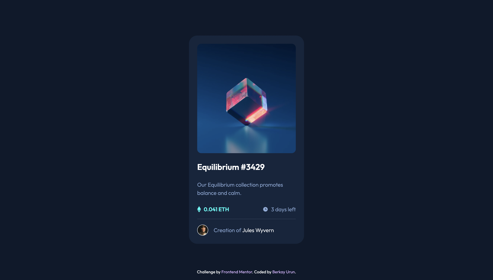

# Frontend Mentor - NFT preview card component solution

This is a solution to the [NFT preview card component challenge on Frontend Mentor](https://www.frontendmentor.io/challenges/nft-preview-card-component-SbdUL_w0U).

## Table of contents

- [Overview](#overview)
  - [The challenge](#the-challenge)
  - [Screenshot](#screenshot)
  - [Links](#links)
- [My process](#my-process)
  - [Built with](#built-with)
  - [What I learned](#what-i-learned)
- [Author](#author)

## Overview

### The challenge

Users should be able to:

- View the optimal layout depending on their device's screen size
- See hover states for interactive elements

### Screenshot



### Links

- Solution URL: [GitHub Repo](https://github.com/brkyurun/fm-nft-preview-card-component-challenge)
- Live Site URL: [GitHub Pages](https://brkyurun.github.io/fm-nft-preview-card-component-challenge/)

## My process

### Built with

- Semantic HTML5 markup
- Flexbox
- Mobile-first workflow
- [React](https://reactjs.org/) - JavaScript library
- [TypeScript](https://www.typescriptlang.org/) - A static type-checker for JavaScript
- [TailwindCSS](https://tailwindcss.com/) - A utility-first CSS framework
- [Vite](https://vitejs.dev/) - A fast and no-config build tool

### What I learned

During the development process, I tried to apply the React approach as much as possible by breaking and parts of the component. I also decided to take props on some of the components to try and enable reusability of the component.

I had some difficulties when trying to do the hover state for the card image. Initially, I tried to solve this problem using React refs, but that did not work the way I intended. After some thought, I managed to solve the hover state for that part by using just CSS (well, TailwindCSS to be exact :D). I applied a hover state on the overlay and set the initial opacity to 0, mimicking the behaviour of "display: none;".

Here's the result for that part:

```js
export function Card () {
  return (
    //...
    <div className="overflow-hidden rounded-xl h-72 w-72 xl:h-80 relative">
      
      <div className="opacity-0 hover:opacity-100 flex cursor-pointer transition-all duration-150 items-center justify-center h-full w-full absolute top-0 bg-primary-cyan/50">
        
      </div>
  </div>
  //...);
}
```

## Author

- LinkedIn - [Berkay Urun](https://www.linkedin.com/in/berkayurun/)
- Frontend Mentor - [@brkyurun](https://www.frontendmentor.io/profile/brkyurun)
- Twitter - [@darkhorizontal](https://twitter.com/darkhorizontal)
